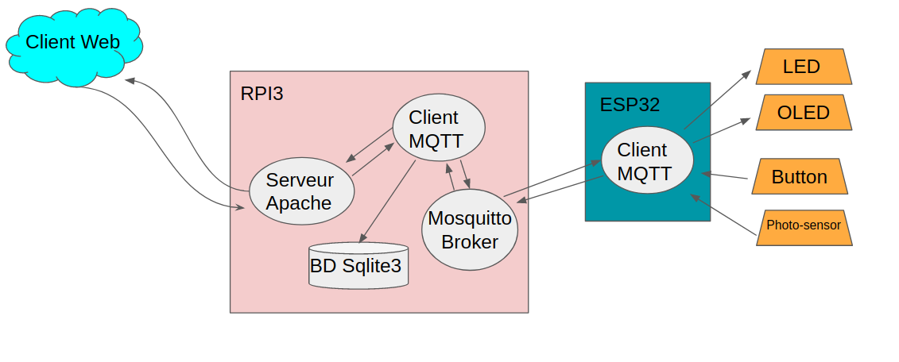

### Made by 
[Louis Geoffroy Pitailler](https://github.com/lovisXII) \
[Kevin Lastra](https://github.com/kevinlastra)

# Introduction 

The goal of this project was to make a Raspberry Pi3 communicate with an ESP32, via the MQTT protocol using the Mosquitto broker.
The Raspberry will host a broker, an Apache HTTP server and a database. In detail we have set the following objectives:
1. Develop a web page, which will be hosted on the Apache server, which will allow to drive the esp32,
2. Create a database to store information about the exchanged data,
3. Use the different modules connected to the esp32, which in our case are:
    - A LED
    - An LCD screen
    - A button 
    - A photo-diode

# Work done

## Schematic of the project architecture


## WEB
We have developed an HTML WEB page using php to manage the server side. We also added a part written in javascript to manage the client side.
This web page is written in the index.php file (index.php) at the root of the folder ("/var/www/SESIBG.com/public_html") that we have designated in the apache2 server configuration.

In the index.php file we defined 3 checkboxes and a text zone with a button, allowing to control the led, to read the value of the button, the photo-diode and to write on the LCD screen.
```html
<div style="width: 30%; float: left;">
   Get Button value
  </br>
  <div class="toggle-container">
    <input type="checkbox" id="btn_checkbox" onchange="submit_btn()" 
        <?php if($btn_checked == 1) {echo " checked='checked'";}?>>
    <div class="slider round"></div>
  </div>
</div>
```
For each checkbox and each button we added an attribute "onchange" or "onclick" to call the functions defined in javascript. These functions will allow us to send data to the server via POST requests, without having to refresh the web page. Indeed, if we don't do that, when we use a simple form in HTLM and we click on the submit button, the page will be refreshed and the data received will be lost.


To send data to the serverUr we use the fetch function with the POST method.

> fetch(url, [options])
>
> url : can be a link to a web page or the address of a local file.
> 
> options : allows you to define the options, i.e. whether you want to make a POST or a GET.

We give as parameter to this function the path of a php file which will treat the POST request and which will recover the parameters necessary for this POST.

### Function fetch et command pour requette POST

```js
formData.append('led',val);
fetch("write_pipe.php", {method: 'POST', body: formData})
.then(function (response){
    console.log(response);
});
```
The server's response is displayed after making the POST request.

### Example of php code that will process the POST request:

```php
if(isset($_POST['led']))
{
    $get = $_POST['led'];
    if($get == "true")
        $get = "LEDON";
    else
        $get = "LEDOFF";
}
```
Once the request is received, we process it and write it in a fifo.

```php
$pipe = "s2c_LG";
if(!file_exists($pipe))
{
    $mode = 0600;
    posix_mkfifo($pipe, $mode);
}
$myfile = fopen($pipe, "w");

.....

if($get != "")
    fwrite($myfile, $get);

fclose($myfile);
```
Once the button and photo-diode commands have been sent, we need to receive the corresponding data.
But we face a problem since the server cannot modify the HTML on the client side. To solve this problem we just need to create a timer that will make GET requests every n-seconds and that will allow us to display the result in the HTML page.

### Timer
```js
setInterval(function() {
...
}, 2000);
```
### GET request

```js
fetch("btn.json")
.then((response) => {
    return response.json();
})
.then((data) => {
    var html = "<label>Button state:  "+data.state+"</label>";
    document.getElementById('btnstats').innerHTML = html;
});
```

## MQTT client interface and web server

This program has 3 features:

1. Read the commands sent by the web server via the fifo and transmit them to the mosquitto broker on the corresponding topic.

```c
  int s2c = open(s2c_name, O_RDWR | O_NONBLOCK);

  while(sync_end)
  {
    FD_ZERO(&rfds);
    FD_SET(s2c, &rfds);

    if(select(s2c+1, &rfds, NULL, NULL, &tv) != 0)
    {
      if(FD_ISSET(s2c, &rfds))
      {
        int nbchar;
        if((nbchar = read(s2c, serverRequest, MAXserveurRequest)) == 0) break;
        ....
        // request treatment
        ...
      }
    }
  }

  // publication of the order in the respective topic
  while(sync_end)
  {
    if(sync_msg.valid)
    {
      mosquitto_publish(mosq, NULL, sync_msg.topic, sync_msg.command_size, sync_msg.command, 0, false);
    }
  }
```
We used syncronization variables to communicate between threads. Indeed the reading of the requests of the web server and the reading of the data of the broker are on 2 different threads.

2. Read the data of a topic to which we subscribed, send the data to the broker and write them in a .json file which will be read by the client of the web page.

```c
void on_message(struct mosquitto* mosq, void* obj, const struct mosquitto_message* msg)
{
  int size = strlen((char*)msg->payload);
  if(strcmp(msg->topic, "SERVER/light") == 0)
  {
    sync_ls.valid = 1;
    sync_ls.value = (char*)malloc(size);
    strcpy(sync_ls.value, (char*)msg->payload);
    sync_ls.msg_size = size;
  }
  ... 
}
```

3. Write all SQLite3 data exchanges to a database with the following format:
> Topic | commande | Date
```c
  sprintf(req,"INSERT INTO communication_log VALUES ('%s','%s',datetime('now'))",msg->topic, msg->payload);

  char* zErrMsg = 0;
  int rc = sqlite3_exec(db, req, callback, 0, &zErrMsg);
```

## Program on the ESP32

This program will allow to read the commands that have been sent from the MQTT client using the callback.\ function

For example LEDON will allow to light the LED with the function digitalWrite(pin, value).

```cpp
void callback(char* topic, byte* message, unsigned int length) {
  char* messageTemp = (char*)malloc(sizeof(char)*length);

  for (int i = 0; i < length; i++) {
    messageTemp[i] = (char)message[i];
  }

  if(strcmp(topic, "ESP/led") == 0)
  {
    if(strncmp(messageTemp, "ON", 2) == 0)
    {
      digitalWrite(LED_PIN, HIGH);
    }
    else if(strncmp(messageTemp, "OFF", 3) == 0)
    {
      digitalWrite(LED_PIN, LOW);
    }
  }
  ...
```

If it is a command like BTNON it will read the status (pressed or not). It will then send the read value every n-seconds using the ``waitfor()`` function, allowing time for the photo-diode and the button to process the data sending without blocking the reception of other commands.

```cpp
if(btn_stats_on && waitFor(ls_s.timer, ls_s.period))
{
  btn_s.state = 1-digitalRead(BTN_PIN);
  char str[16];
  itoa(btn_s.state, str, 10);
  client.publish("SERVER/button", str);
}
```

# Shell script

In order to facilitate the setting of the broker on the raspberry, we wrote two shell files ``server.sh`` and ``ssh_script.sh``.\.
These two files allow to connect to the raspberry (with the ip and port number as parameters of the script), to check that mosquitto is installed and if it is not the case to do it.
Once mosquitto is installed the script will then check if it finds the line giving the listening port of the broker in the config file and if allow_anonymous is on true.
If it doesn't find it, it adds it with the port number entered as argument. If it finds it, it modifies it with the corresponding port number. 

# Sources :

https://randomnerdtutorials.com/esp32-mqtt-publish-subscribe-arduino-ide/

https://iotdesignpro.com/projects/how-to-connect-esp32-mqtt-broker
